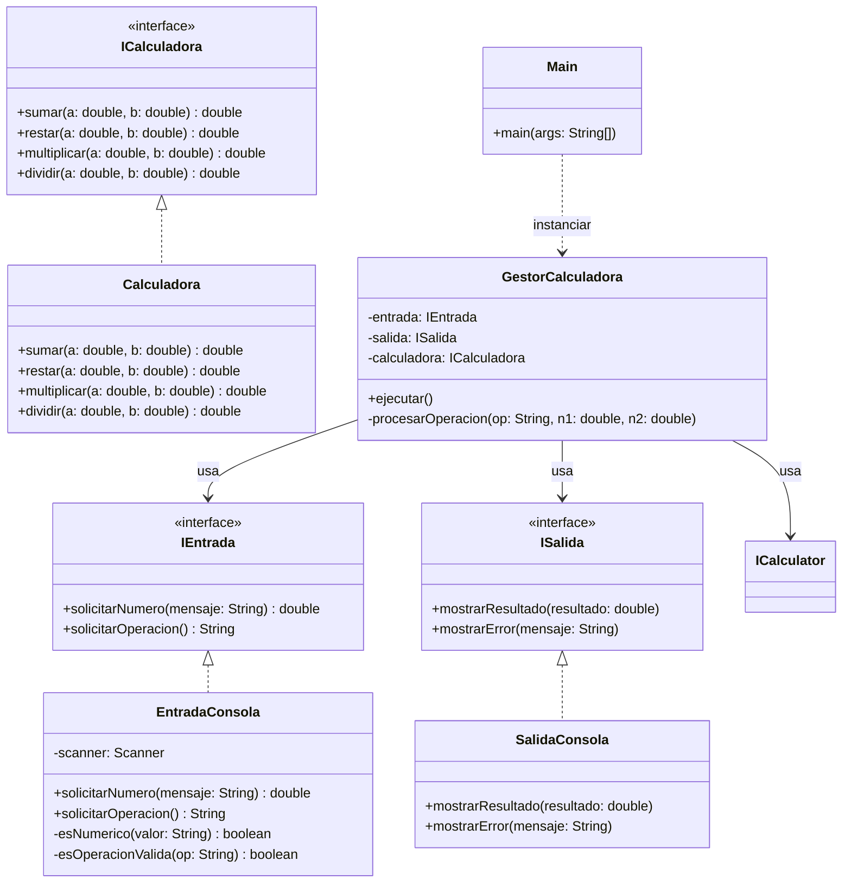

    Main ..> GestorCalculadora : instanciar
    GestorCalculadora --> IEntrada : usa
    GestorCalculadora --> ISalida : usa
    GestorCalculadora --> ICalculator : usa
    IEntrada <|.. EntradaConsola
    ISalida <|.. SalidaConsola
    ICalculadora <|.. Calculadora
